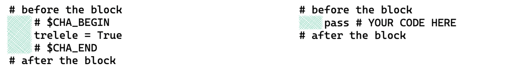
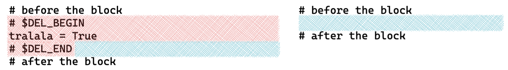
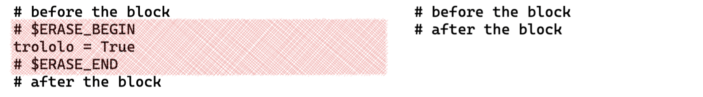
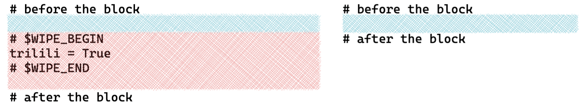
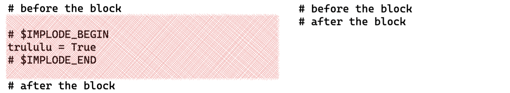

generate challenges from solutions using code block delimiters

## install

``` bash
pip install challengify                 # from gemfury using `~/.pip/pip.conf`
pip uninstall -y challengify            # uninstall
alias cha="challengify $@"              # alias
```

## sub commands

| command | usage |
| --- | --- |
| [iterate](doc/README_iterate.md) | generate several challenge versions from a single codebase |
| [test](doc/README_test.md) | generate temporary challengified files |
| [generate](doc/README_generate.md) | create `~/.challengify.yaml` conf file |
| [inject](doc/README_inject.md) | deprecated |

## commands

generate challenges in destination directory from solutions files and directory trees within the provided scope

``` bash
challengify run --help                  # list options

challengify run sources                 # generate challenges from individual files and directory trees
challengify run --all                   # generate challenges from the current directory tree

challengify run --all --force           # force sync even if destination does not have a clean git status
challengify run -af

challengify run -d ../data-cha          # set path to the destination directory (from the root of the project)

challengify run -id test *              # generate challenges from the current directory tree in the test directory

challengify run --dry-run               # do not generate challenges
challengify run --verbose               # list file selection process (scope / expanded scope / git controlled / sync ignored)

challengify run --test                  # generate *test challengification* files for the scope (see the challengify test command)
```

behavior:
- the command can be run anywhere in the solutions directory tree
- the challenges are generated at the corresponding location in the destination directory (source and destination have identical structures)
- the challenges are not written if the git status of the destination directory is not clean, unless the force flag is used
- the files and directories listed in `**/.challengifyignore*` and `.syncignore` are ignored (wildcards supported: `**/*.pickle`)
- the files having a name containing uppercase `WIP`, `HIDDEN`, `ARCHIVE` or `OLD` are ignored
- replacements are handled depending on file extension: `.ipynb`, `.py`, `.rb` and notebook language (python, ruby)

assumptions:
- the user will verify the outcome and commit or revert the changes

## transformations

### notebook cell tags

the tags can be viewed using the menu `View > Cell Toolbar > Tags`

| tag | usage |
| --- | --- |
| `delete` | the cell is deleted |
| `delete_begin` | delete all further cells, including this one |
| `delete_end` | last cell to be deleted by `delete_begin` |
| `challengify` | the content of the cell is replaced |
| `steps` | single line comments are kept, everything else after the first comment is replaced |
| `clear_output` | the output and standard error of the cell are emptied (only valid if the `keep_output` notebook metadata option is set to True) |

### notebook cell content delimiters

| start | end | content |
| --- | --- | --- |
| `$CHALLENGIFY_BEGIN` | `$CHALLENGIFY_END` | replaced by pass comment |
| `$DELETE_BEGIN` | `$DELETE_END` | deleted |

### notebook metadata

the output and standard error of all cells is deleted unless the following conf is added to the notebook metadata

the notebook metadata can be edited using the menu `Edit > Edit Notebook Metadata`

``` json
  "challengify": {
    "keep_output": true
  },
```

### text file delimiters

| start | end | content usage |
| --- | --- | --- |
| `# $CHALLENGIFY_BEGIN` | `# $CHALLENGIFY_END` | replaced by pass comment |
| `# $CHA_BEGIN` | `# $CHA_END` | replaced by pass comment |
| `# $DELETE_BEGIN` | `# $DELETE_END` | deleted |
| `# $DEL_BEGIN` | `# $DEL_END` | deleted |
| `# $ERASE_BEGIN` | `# $ERASE_END` | block newline is consumed |
| `# $WIPE_BEGIN` | `# $WIPE_END` | block newline + following newline are consumed |
| `# $IMPLODE_BEGIN` | `# $IMPLODE_END` | block newline + surrounding newlines are consumed |

`challengify` keeps indentation




`delete` does not consume the block newline



`erase` consumes the block newline



`wipe` consumes the block newline and the following one



`implode` consumes the block newline and the surrounding newlines



## transformations rollback

the destination directory is assumed to be git controlled

``` bash
git restore .                           # remove uncommitted changes in existing files

git clean -nfd                          # remove added files, dry run
# git clean -fd                         # actually remove added files
```

## replacements

notebook replacements occur depending on cell type (markdown or code) and metadata declared language

text file replacements occur depending on the language (file extension)

| language | replacement |
| --- | --- |
| notebook markdown | `> YOUR ANSWER HERE` |
| python | `pass  # YOUR CODE HERE` |
| other | `# YOUR CODE HERE` |
