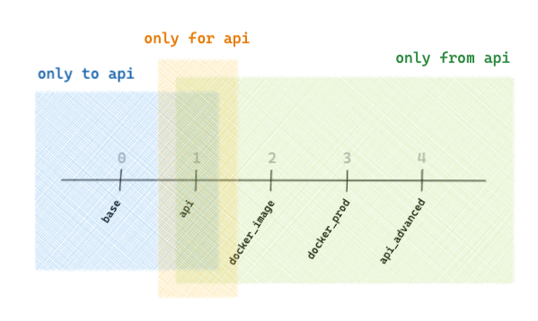

# install

from gemfury with `~/.pip/pip.conf`:

``` bash
pip install challengify
```

# uninstall

``` bash
pip uninstall -y challengify
```

# aliases

``` bash
alias cha="challengify $@"
```

# about

generate challenges from solutions

# usage

## challengify

generate challenges in destination directory from solutions files and directory trees within the provided scope

``` bash
challengify run --all                   # generate challenges from the current directory tree
challengify run -a

challengify run sources                 # generate challenges from individual files and directory trees

challengify run --help                  # list options

challengify run --all --force           # force sync even if destination does not have a clean git status
challengify run -af

challengify run -d ../data-cha          # set path to the destination directory (from the root of the project)

challengify run -id test *              # generate challenges from the current directory tree in the test directory

challengify run --dry-run               # do not generate challenges
challengify run --verbose               # list file selection process (scope / expanded scope / git controlled / sync ignored)

challengify run --test                  # generate *test challengification* files for the scope (see the challengify test command)
```

behavior:
- the command can be run anywhere in the solutions directory tree
- the challenges are generated at the corresponding location in the destination directory (source and destination have identical structures)
- the challenges are not written if the git status of the destination directory is not clean, unless the force flag is used
- the files and directories listed in `**/.challengifyignore*` and `.syncignore` are ignored (wildcards supported: `**/*.pickle`)
- the files having a name containing uppercase `WIP`, `HIDDEN`, `ARCHIVE` or `OLD` are ignored
- replacements are handled depending on file extension: `.ipynb`, `.py`, `.rb` and notebook language (python, ruby)

assumptions:
- the user will verify the outcome and commit or revert the changes

restoring destination directory:

``` bash
git restore .                           # remove uncommitted changes in existing files

git clean -nfd                          # remove added files, dry run
# git clean -fd                         # actually remove added files
```

## test

generate *test challengification* files for the provided scope, with each file located next to the source file

any file matching the pattern `*_challengify*` or `.*_challengify*` is considered a *test challengification* file generated by this command and is considered fair game to write or remove

no safeguards are provided when writing or removing such files, which are considered temporary data and can be gitignored

``` bash
challengify test                        # generate *test challengification* files for the scope
                                        # all files are generated in place (next to the source file: the destination parameter of the run command is ignored)
                                        # the file root is suffixed by `_challengify`:
                                        # `path/to/stuff.md` => `path/to/stuff_challengify.md`

challengify clean                       # remove all *test challengification* files in the current directory
                                        # no undo command available
```

## generate

generate default parameters conf file in `~/.challengify.yaml`:

``` bash
challengify gen                         # generate conf file
challengify gen --force                 # override existing conf file
```

default conf file:

``` yaml
run:
  destination: ../data-challenges
  force: False
  dry_run: False
  verbose: False
  all: False
```

## iterate

generate iterative solution exercices based on the `.challengify_iterate.yml`

``` bash
challengify iterate .                   # generate iterative solution exercices

challengify iterate . -c base..api      # generate challenge version from base to api
challengify iterate . -c base..         # generate challenge version from base
challengify iterate . -c ..api          # generate challenge version to api
challengify iterate . -c api            # generate challenge version api
challengify iterate . -c 1..3           # generate challenge versions from 1 to 3 included
```

### conf file

``` yaml
iterate:

  # list of files and directories to process (currently only supports one)
  source: taxifare

  # path to the destination directory from the root of the project
  destination: ../data-solutions/07-ML-Ops

  # list of challenge versions to process along with target directory relative to the `destination`
  versions:
    base: 01-Train-at-scale/04-Investigating-bottlenecks
    api: 04-Predict-in-production/01-Build-your-API
    docker_image: 04-Predict-in-production/02-Docker-image
    docker_prod: 04-Predict-in-production/03-Deploy-to-Cloud-Run
    api_advanced: 04-Predict-in-production/04-API-advanced

  # list of rules defining on which versions of the challenge a file is present
  only:
    to:
      api:
        - taxifare/introduction.md
    for:
      api:
        - taxifare/notebooks/api_boilerplate.ipynb
        - taxifare/notebooks/api_usage.ipynb
    from:
      api:
        - taxifare/api/__init__.py
        - taxifare/api/fast.py
      docker_image:
        - taxifare/Dockerfile
        - taxifare/Dockerfile_intel
        - taxifare/Dockerfile_silicon
        - taxifare/requirements_intel.txt
        - taxifare/requirements_silicon.txt
```



### delimiters

#### notebooks

currently not supported

#### code file delimiters

| start | end | content presence |
| --- | --- | --- |
| `# $ONLY_TO_version_BEGIN` | `# $ONLY_TO_version_END` | for challenge versions up to `version` (included) |
| `# $ONLY_FOR_version_BEGIN` | `# $ONLY_FOR_version_END` | for challenge version `version` |
| `# $ONLY_FROM_version_BEGIN` | `# $ONLY_FROM_version_END` | for challenge versions from `version` (included) |

example:
``` python
    # $ONLY_api_BEGIN
    # content only available for version api of the challenge
    # $ONLY_api_END
```

troubleshoot: a delimiter having a version (here `12`) outside of the range of destinations defined in the conf file (`14` to `15`) will be ignored

## injection

generate solutions from branches of a repo

``` bash
challengify inject .challengify_actions.yaml # runs injections listed in yaml file
```

vs

``` bash
challengify inject .sync_actions.yaml   # runs injections listed in yaml file
```

# transformations

transformations can be defined for notebooks or code files

supported content:
- jupyter notebooks cells (markdown, and code: python, ruby)
- code files (python, ruby)

common transformation verbs:
- delete (remove a cell or the delimited content)
- challengify (replace the content of a cell or the delimited content)

## notebooks

transformations can be configured through:
- the tags attached to a cell
- the delimiters defined in the content of a cell

### cell tags

the tags can be viewed using the menu `View > Cell Toolbar > Tags`

| tag | usage |
| --- | --- |
| `delete` | the cell is deleted |
| `delete_begin` | delete all further cells, including this one |
| `delete_end` | last cell to be deleted by `delete_begin` |
| `challengify` | the content of the cell is replaced |
| `steps` | single line comments are kept, everything else after the first comment is replaced |
| `clear_output` | the output and standard error of the cell are emptied (only valid if the `keep_output` notebook metadata option is set to True) |

### cell content delimiters

| start | end | content usage |
| --- | --- | --- |
| `$CHALLENGIFY_BEGIN` | `$CHALLENGIFY_END` | replaced by pass comment |
| `$DELETE_BEGIN` | `$DELETE_END` | deleted |

### notebook metadata

the output and standard error of all cells is deleted unless the following conf is added to the notebook metadata

the notebook metadata can be edited using the menu `Edit > Edit Notebook Metadata`

``` json
  "challengify": {
    "keep_output": true
  },
```

## code file delimiters

| start | end | content usage |
| --- | --- | --- |
| `# $CHALLENGIFY_BEGIN` | `# $CHALLENGIFY_END` | replaced by pass comment |
| `# $DELETE_BEGIN` | `# $DELETE_END` | deleted |
| `# $DEL_BEGIN` | `# $DEL_END` | deleted |
| `# $ERASE_BEGIN` | `# $ERASE_END` | block newline is consumed |
| `# $WIPE_BEGIN` | `# $WIPE_END` | block newline + following newline are consumed |
| `# $IMPLODE_BEGIN` | `# $IMPLODE_END` | block newline + surrounding newlines are consumed |

## replacements

replacements occur in notebooks depending on:
- the cell type (markdown or code)
- the language declared in the notebook metadata

replacements occur in the code files depending on the language (file extension)

markdown replacement:
- `> YOUR ANSWER HERE`

code replacement:
- `pass  # YOUR CODE HERE` (python)
- `# YOUR CODE HERE` (ruby)
