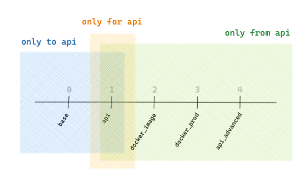

`challengify iterate` generates iterative solution exercices based on a `.challengify_iterate.yml` conf file

## commands

``` bash
challengify iterate .                   # generate iterative solution exercices

challengify iterate . -c base..api      # generate challenge version from base to api
challengify iterate . -c base..         # generate challenge version from base
challengify iterate . -c ..api          # generate challenge version to api
challengify iterate . -c api            # generate challenge version api
challengify iterate . -c 1..3           # generate challenge versions from 1 to 3 included
```

## conf file

``` yaml
iterate:

  # list of files and directories to process (currently only supports one)
  source: taxifare

  # path to the destination directory from the root of the project
  destination: ../data-solutions/07-ML-Ops

  # list of challenge versions to process along with target directory relative to the `destination`
  versions:
    base: 01-Train-at-scale/04-Investigating-bottlenecks
    api: 04-Predict-in-production/01-Build-your-API
    docker_image: 04-Predict-in-production/02-Docker-image
    docker_prod: 04-Predict-in-production/03-Deploy-to-Cloud-Run
    api_advanced: 04-Predict-in-production/04-API-advanced

  # list of rules defining on which versions of the challenge a file is present
  only:
    to:
      api:
        - taxifare/introduction.md
    for:
      api:
        - taxifare/notebooks/api_boilerplate.ipynb
        - taxifare/notebooks/api_usage.ipynb
    from:
      api:
        - taxifare/api/__init__.py
        - taxifare/api/fast.py
      docker_image:
        - taxifare/Dockerfile
        - taxifare/Dockerfile_intel
        - taxifare/Dockerfile_silicon
        - taxifare/requirements_intel.txt
        - taxifare/requirements_silicon.txt
```



## notebook delimiters

currently not supported

## code file delimiters

| start | end | versions presence |
| --- | --- | --- |
| `# $ONLY_TO_version_BEGIN` | `# $ONLY_TO_version_END` | up to `version` (included) |
| `# $ONLY_FOR_version_BEGIN` | `# $ONLY_FOR_version_END` | only for version `version` |
| `# $ONLY_FROM_version_BEGIN` | `# $ONLY_FROM_version_END` | from `version` (included) |

example:
``` python
# $ONLY_FOR_api_BEGIN
# content only available for version api of the challenge
# $ONLY_FOR_api_END
```

### delimiter generator delimiters

generates a `verb` delimiter for the corresponding version (`challengify`, `cha`, `delete`, `del`, `erase`, `wipe`, `implode`)

| start | end | versions presence |
| --- | --- | --- |
| `# $verb_ONLY_TO_version_BEGIN` | `# $verb_ONLY_TO_version_END` | `verb` up to `version` (included) |
| `# $verb_ONLY_FOR_version_BEGIN` | `# $verb_ONLY_FOR_version_END` | `verb` only for version `version` |
| `# $verb_ONLY_FROM_version_BEGIN` | `# $verb_ONLY_FROM_version_END` | `verb` from `version` (included) |

example:
``` python
# $CHALLENGIFY_ONLY_FOR_api_BEGIN
# content challengified for version api of the challenge and available as is for other versions
# $CHALLENGIFY_ONLY_FOR_api_END
```

troubleshoot: a delimiter having a version (`12`) outside of the range of versions defined in the conf file (`14` to `15`) will be ignored
