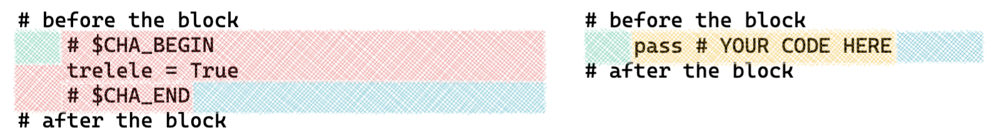
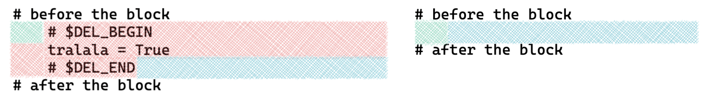
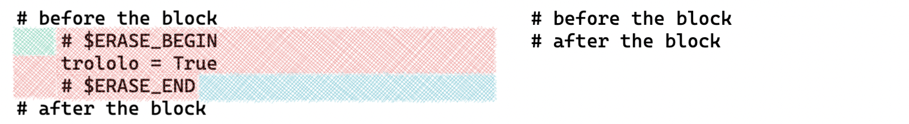
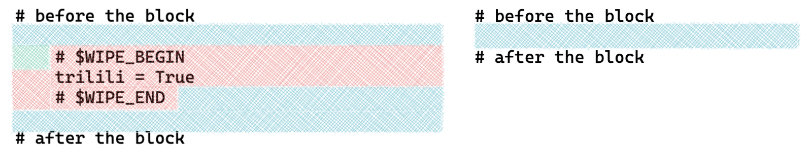
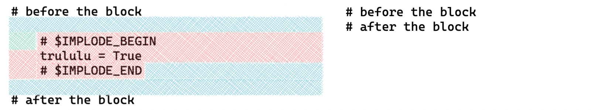

## Content Creation 📝 

The publication workflows attached to the `.github` directory of a `*-solution` repo allow to generate the matching `*-challenge` repo

The challenge repo is generated by challengifying the content of the solution repo and is kept in sync whenever new content is pushed to the solution repo. So as content creator, you only need to make changes in the solution repo!

The pull requests created on the solution repo are also challengified and kept in sync in the challenge repo, which allows to verify the impact of a pull request on the challenge repo by, for example, previewing the PR created in the challenge repo.

## Ignored Files 🚫 

It is possible to ignore files, directories and patterns so that the corresponding content is not challengified neither published to the challenge repo.

this is achieved by editing a `.challengifyignore` file, which works similarly to a `.gitignore` file:

```
# comment

# ignore `.challengifyignore` files anywhere in the directory structure
**/.challengifyignore

# ignore files ending in `_solution.ipynb` anywhere in the directory structure
**/*_solution.ipynb

# ignore a specific file referenced by relative path
01-Python/02-Data-Sourcing/01-CSV/some_test_file.py
```

## code file transformations

### text file delimiters

| start | end | content usage |
| --- | --- | --- |
| `# $CHALLENGIFY_BEGIN` | `# $CHALLENGIFY_END` | replaced by pass comment |
| `# $CHA_BEGIN` | `# $CHA_END` | replaced by pass comment |
| `# $DELETE_BEGIN` | `# $DELETE_END` | deleted |
| `# $DEL_BEGIN` | `# $DEL_END` | deleted |
| `# $ERASE_BEGIN` | `# $ERASE_END` | block newline is consumed |
| `# $WIPE_BEGIN` | `# $WIPE_END` | block newline + following newline are consumed |
| `# $IMPLODE_BEGIN` | `# $IMPLODE_END` | block newline + surrounding newlines are consumed |

`challengify` keeps indentation



`delete` does not consume the block newline



`erase` consumes the block newline



`wipe` consumes the block newline and the following one in order to keep outer blocks evenly spaced



`implode` consumes the block newline and the surrounding newlines in order to remove outer blocks spacing



## notebook transformations

### notebook cell tags

the tags can be viewed using the menu `View > Cell Toolbar > Tags`

| tag | usage |
| --- | --- |
| `delete` | the cell is deleted |
| `delete_begin` | delete all further cells, including this one |
| `delete_end` | last cell to be deleted by `delete_begin` |
| `challengify` | the content of the cell is replaced |
| `steps` | single line comments are kept, everything else after the first comment is replaced |
| `clear_output` | the output and standard error of the cell are emptied (only valid if the `keep_output` notebook metadata option is set to True) |

### notebook cell content delimiters

| start | end | content |
| --- | --- | --- |
| `$CHALLENGIFY_BEGIN` | `$CHALLENGIFY_END` | replaced by pass comment |
| `$DELETE_BEGIN` | `$DELETE_END` | deleted |

### notebook metadata

the output and standard error of all cells is deleted unless the following conf is added to the notebook metadata

the notebook metadata can be edited using the menu `Edit > Edit Notebook Metadata`

``` json
  "challengify": {
    "keep_output": true
  },
```

## replacements

code files text replacements occur depending on the programming language of the content (file extension)

notebook replacements occur depending on the cell type (markdown or code) and on the notebook metadata declared language

| language | replacement |
| --- | --- |
| python | `pass  # YOUR CODE HERE` |
| notebook markdown | `> YOUR ANSWER HERE` |
| other | `# YOUR CODE HERE` |
